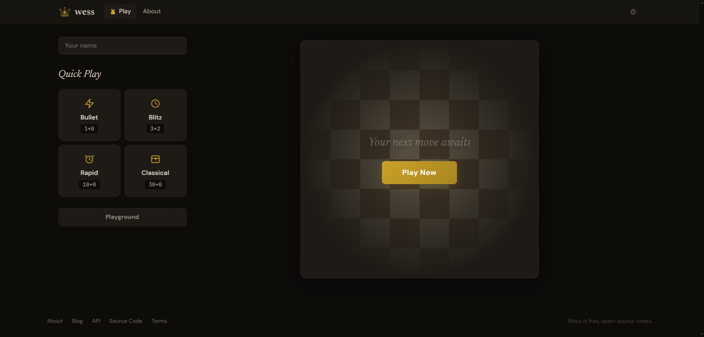
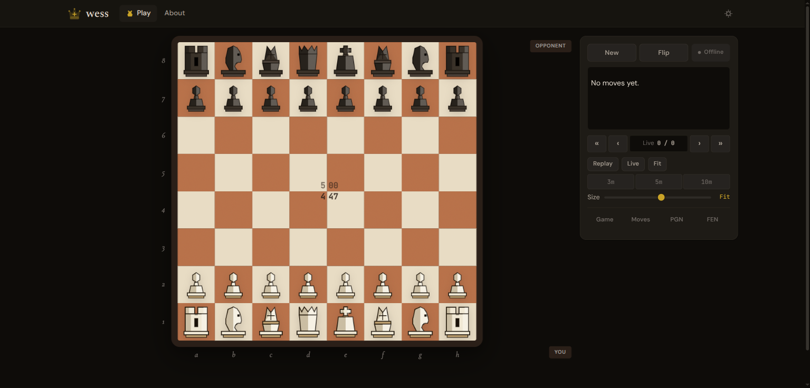
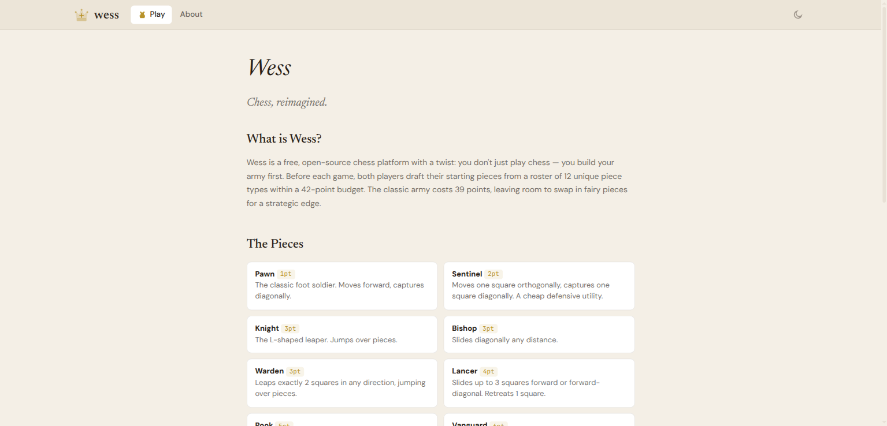

<p align="center">
  
</p>

<h1 align="center">wess</h1>

<p align="center"><em>Chess, reimagined. Draft your army. Play online.</em></p>

---

**Wess** is a free, open-source chess platform where you build your army before each game. Choose from 12 unique piece types within a 42-point budget, then battle online with custom armies.

## Screenshots

| Lobby | Game |
|-------|------|
|  |  |

| About |
|-------|
|  |

## Features

- **Army Draft System** — 12 piece types (6 classic + 6 fairy), 42-point budget, drag-and-drop placement
- **Real-time Multiplayer** — SSE-based, with waiting room, draft timer countdown, and share link
- **5 Fairy Pieces** — Sentinel (2pt), Warden (3pt), Lancer (4pt), Vanguard (6pt), Chancellor (8pt)
- **On-board Clocks** — time displayed directly on the board squares
- **15-second Grace Period** — first moves are free, game cancels if not made in time
- **Resign, Draw, +15s** — full game management with rematch support
- **Right-click Arrows** — draw turquoise arrows and circle highlights for analysis
- **Dark & Light Theme** — toggle in the header
- **Playground Mode** — local timeless play, draft both sides
- **Spectator Mode** — watch live games with both player names
- **Board Size Control** — adjustable slider with auto-fit option
- **Zero Dependencies** — no runtime libraries, everything built from scratch

## Piece Roster

| Piece | Cost | Movement |
|-------|------|----------|
| Pawn | 1 | Forward, diagonal capture, en passant, promotion |
| Sentinel | 2 | 1 orthogonal (move), 1 diagonal (capture) |
| Knight | 3 | L-shaped leap |
| Bishop | 3 | Diagonal slide |
| Warden | 3 | Leap exactly 2 squares any direction |
| Lancer | 4 | Slide 3 forward/forward-diagonal, 1 retreat |
| Rook | 5 | Orthogonal slide, castling |
| Vanguard | 6 | Diagonal slide + 2 orthogonal (move only) |
| Archbishop | 7 | Bishop + Knight |
| Chancellor | 8 | Rook + Knight |
| Queen | 9 | All directions |
| King | free | 1 square, castling (mandatory) |

## Getting Started

```bash
npm install
npm run dev        # Starts both Vite (port 4173) and multiplayer server (port 3000)
```

Open http://127.0.0.1:4173 in your browser.

### Other Commands

```bash
npm run start      # Vite dev server only
npm run server     # Multiplayer server only
npm run build      # Production build
npm run test       # All tests (unit + browser)
npm run test:unit  # Vitest unit tests
npm run test:browser  # Playwright browser tests
npm run typecheck  # TypeScript type checking
```

## Architecture

Three-layer structure: **domain** (pure logic) → **app** (orchestration) → **ui** (rendering).

```
src/
├── domain/          # Chess engine, session, draft, tactics (no browser APIs)
├── app/             # Controller, multiplayer, settings, draft controller
├── ui/              # Board rendering, animations, audio, piece SVGs
├── main.ts          # Entry point + routing
├── lobby.ts         # Lobby interactivity
├── router.ts        # Client-side pushState router
└── styles.css       # All styles
```

- **Zero runtime dependencies** — TypeScript, Vite, Vitest, Playwright are dev-only
- **Custom chess engine** — move generation, FEN/SAN, check/checkmate, all special rules
- **Extensible piece system** — add a piece with just a definition + SVG
- **Vanilla Node.js server** — in-memory rooms, token auth, SSE broadcast

## Tech Stack

- TypeScript (strict mode, ES2022)
- Vite 7
- Vitest + Playwright
- Web Audio API (synthesized sounds)
- Canvas + SVG (animations and arrows)
- Server-Sent Events (real-time multiplayer)

## License

MIT
